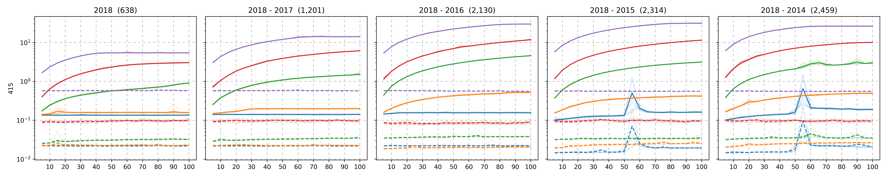

.. _PaperA:

Paper A
#######################

In this paper we use <DATASET> which consists of :math:`k`-mers

.. raw:: html

    
    

        <figure>
            
              
            <figurecaption>Figure 1. <i>Intra-class accuracies.</i></figurecaption>
        </figure>
         
    

.. raw:: html

    
    

        <figure>
            
              
            <figurecaption>Figure 2. <i>Training and Evaluation Times.</i></figurecaption>
        </figure>
         
    
