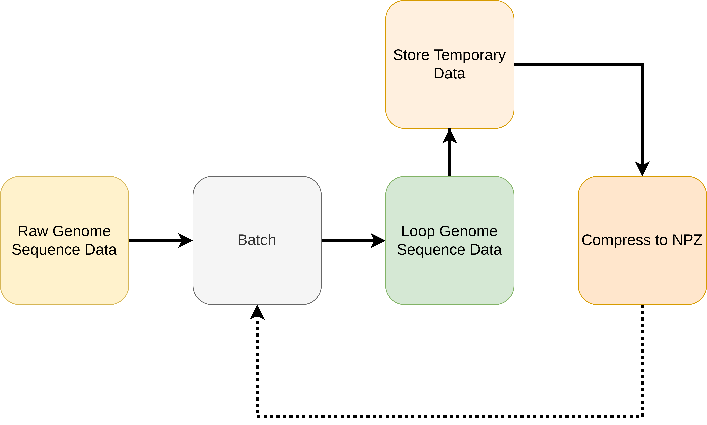

.. _Preprocessing:

Preprocessing
##########################

Preprocessing of the raw genome sequence data is required as the raw format has the form

.. code-block:: text

    sequence_1 | identifier_{1,1}:count_{1,1} identifier_{1,1}:count_{2,1} ...
    sequence_2 | identifier_{2,1}:count_{2,1} identifier_{2,1}:count_{2,2} ...
    ...

This means to read a given identifier, all rows need to be read. For example, suppose we wanted to read all sequence information for the :math:`i`-th identifier. This would be a vector of size :math:`m` where :math:`m` is the number of sequences and the :math:`j`-th element of the vector is the count of how many times the :math:`j`-th sequence appeared for the :math:`i`-th strain. To construct this vector, we loop over all rows in the above example, and if on the :math:`j`-th row the identifier of interest is present, we assign the associated count value, otherwise, zero.

The operation described thus far is computationally expensive when the number of sequences, :math:`m`, is large. To reduce this cost, we transpose the data such that it has the following form

.. code-block:: text

    identifier_1 | sequence_{1,1}:count_{1,1} sequence_{1,1}:count_{2,1} ...
    identifier_2 | sequence_{2,1}:count_{2,1} sequence_{2,1}:count_{2,2} ...
    ...

where each row is a seperate file which has the name format ``<identifier>.npz``. We have chosen the file extension ``.npz`` as it is a compressed data format which is ``numpy`` friendly.

Below, we show a diagram of this process, and example code execution.

.. raw:: html

    
    

        <figure>
            
              
            <figurecaption>Figure 1. <i>Preprocessing pipeline.</i></figurecaption>
        </figure>
         
    

.. code-block:: text

    >>> python -m genolearn --help

        usage: __main__.py [-h] [-batch_size BATCH_SIZE] [-verbose VERBOSE] [-n_processes N_PROCESSES] [-sparse SPARSE] [-dense DENSE] [-debug DEBUG] [--not_low_memory] output_dir genome_sequence_path

        Processes a gunzip (gz) compressed text file containing genome sequence data of the following sparse format

            sequence_1 | identifier_{1,1}:count_{1,1} identifier_{1,1}:count_{2,1} ...
            sequence_2 | identifier_{2,1}:count_{2,1} identifier_{2,1}:count_{2,2} ...
            ...

        into a directory of .npz files, a list of all the features, and some meta information containing number of
        identifiers, sequences, and non-zero counts.

        Required Arguments
        =======================
            output_dir           : output directory
            genome_sequence_path : path to compressed text file with sparse format

        Optional Arguments
        =======================
            batch_size  = 512    : number of temporary txt files to generate over a single parse of the genome data
            verbose     = 250000 : number of iterations before giving verbose update
            n_processes = 'auto' : number of processes to run in parallel when compressing txt to npy files
            sparse      = True   : output sparse npz files
            dense       = True   : output dense npz files
            debug       = -1     : integer denoting first number of features to consider (-1 results in all features)

        Optional Flags
        =======================
            --not_low_memory     : if not flagged, will write to temporary txt files before converting to npz files, otherwise, will consume RAM to then generate the npz files

        Example Usage
        =======================
            python -m genolearn data raw-data/STEC_14-19_fsm_kmers.txt.gz --batch_size 256
        

    positional arguments:
    output_dir
    genome_sequence_path

    optional arguments:
    -h, --help            show this help message and exit
    -batch_size BATCH_SIZE
    -verbose VERBOSE
    -n_processes N_PROCESSES
    -sparse SPARSE
    -dense DENSE
    -debug DEBUG
    --not_low_memory
