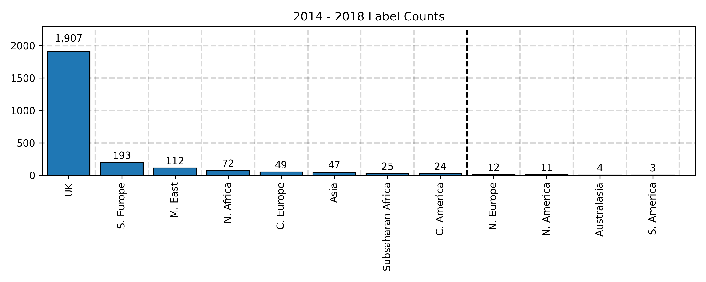
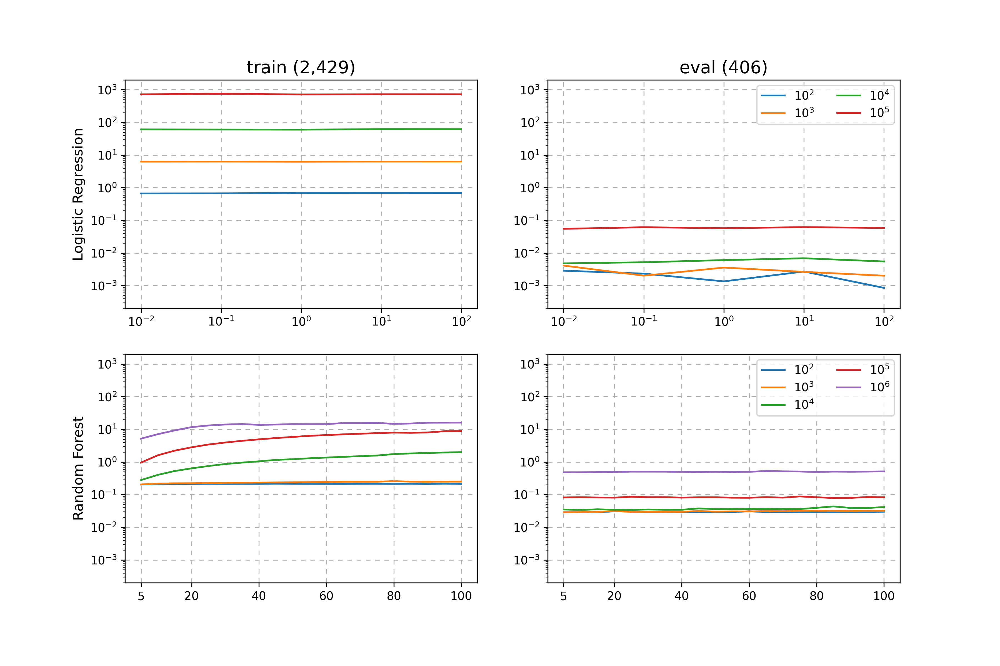
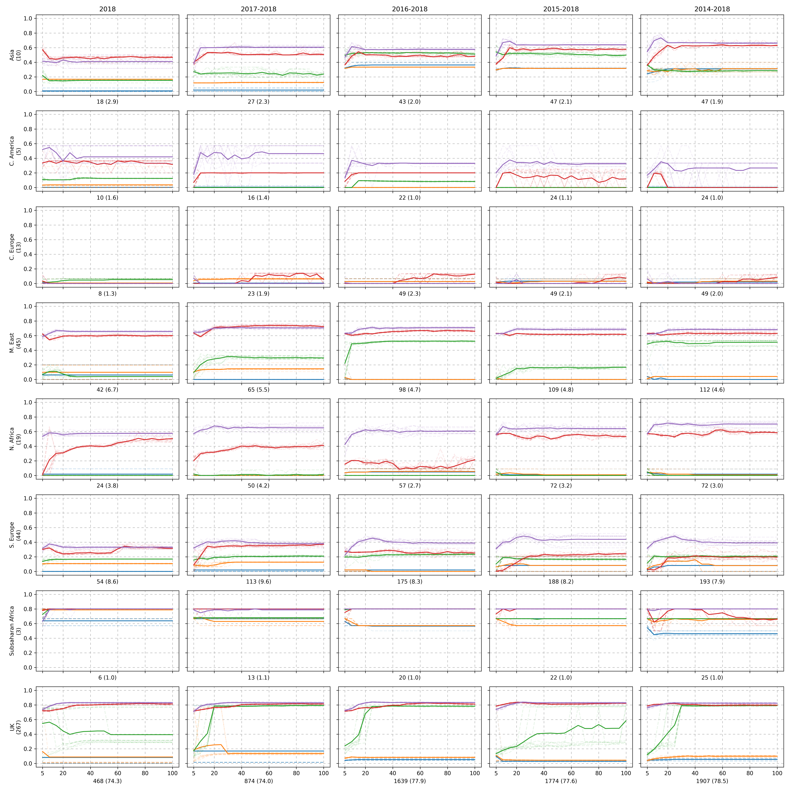

.. _PaperA:

Predicting Strain Origin From k-mer Counts
##########################################

In this case study we talk through how we decided on which strain origin locations were used, how we pre-selected certain :math:`k`-mers to train our machine learning models on, and finally a discussion on our preliminary results with an analysis of which strain origin locations we see our model performing better.

Data
====

Our supervised dataset consists of 2,874 paired datapoints collected over the period 2014-2019. Each pair contains a 12,103,121 :math:`k`-mer count vector and an associated strain origin string. Since we are interested in predicting the strain origin for a new :math:`k`-mer vector, we initially split the data into the periods 2014-2018 (train) and 2019 (validating). At this point we perform a simple analysis of the target origin labels on the training data.

.. raw:: html

    
    

        <figure>
            
              
            <figurecaption>Figure 1. <i>Strain origin counts for data collected in the period 2014 - 2018.</i></figurecaption>
        </figure>
         
    

From the above, we can observe that there is a huge imbalance on origin locations with a heavy skew towards strains originating from the UK. Our experimental paradigm was to originally train on the full 2,474 examples gathered over the period 2014 - 2018 and check our predictions against the 415 data points in the 2019 dataset. Since most predictive models perform better when there are more training examples, we decide to omit strain origin labels with a low count. We have decided arbitrarly that strain origin counts less than 20 should be ignored as indicated by the black dashed line.

Feature Selection by Fisher Scores
==================================

Since the training data is large (2,474 examples each with 12,103,121 :math:`k`-mer counts) it is infeasible to preload it into memory for a model to train on directly. From this point, we motivate the use of feature selection, that is, a way of only using a subset of the :math:`k`-mer counts before any machine learning model is used. We decided to use the Fisher Score to help select which features to use. The score for the :math:`i`-th feature is computed using the following formula.

.. math::

    S_i = \frac{\sum_j n_j(\mu_{ij} - \mu_i)^2}{\sum_j n_j\sigma_{ij}^2}

where

+ :math:`n_j` is the number of observations belonging to the :math:`j`-th class
+ :math:`\mu_j` is the global mean of the :math:`i`-th feature
+ :math:`\mu_{ij}` is the mean of the :math:`i`-th feature belonging to the :math:`j`-th class
+ :math:`\sigma_{ij}^2` is the variance of the :math:`i`-th feature belonging to the :math:`j`-th class
  
After computing a score for each feature, we can simply choose to preload the top :math:`k` scoring features where we choose :math:`k` to be sufficiently small to avoid memory issues.

Experiment
=====================

Our experimental design explores how changing a model complexity parameter affects predictive performance when training on our 2014 - 2018 dataset and evaluated against the 2019 dataset. Further, we only focus on the first **eight** strain origin locations from Figure 1, and we vary the number of :math:`k`-mers we preload but still preserving the order computed by the Fisher Scores as previously discussed.

It is important to note the training and evaluation times for machine learning models vary significantly. Below we show the training and evaluation times of the Logisitic Regression and Random Forest models.

.. raw:: html

    
    

        <figure>
            
              
            <figurecaption>Figure 2. <i>Training and evaluation times. There were 2,429 and 406 data points in the 2014-2018 and 2019 datasets respectively. Colors represent the number of k-mers used and the x-axis represents the main model complexity parameter. Logisitic Regression varies a regularization parameter C and Random Forest varies the maximum depth parameter.</i></figurecaption>
        </figure>
         
    

From the above we can see that each time we increase the number of :math:`k`-mers by an order of magnitude, so does the training time. Comparing the training times of the models, we observe that the Random Forest scales far better and is significantly faster when we consider a large feature space (when we consider a large number of :math:`k`-mers).

Below we show the recall metric for the Random Forest model varying both the number of :math:`k`-mers the model could see and the Random Forest complexity parameter maximum depth.

.. raw:: html

    
    

        <figure>
            
              
            <figurecaption>Figure 3. <i>By region f1-score as the Random Forest complexity parameter, maximum depth, varies. The colours indicate the number of k-mers used as ranked by the Fisher Score for that period where blue, orange, green, red, and purple represent 100, 1,000, 10,000, 100,000, and 1,000,000 k-mers respectively. The numbers below each sublot represent the number of training examplars belonging to the associated region and the number in brackets is the proportion column wise. The number in brackets on the y-axis is the number of examplars belonging to the test period 2019.</i></figurecaption>
        </figure>
         
    

The color scheme for Figure 3 is the same as Figure 2 where each color represents a number of :math:`k`-mers used as ranked by the Fisher Scores. Each row refers to a region with the number of test examples present in the year 2019, and each column varies the training data period - this is to observe the effects of having more data. The x-label shows the number of training data points belonging to the region row and the column period as well as the associated proportion for that period. Each experiment was conducted ten times where each trial is visualised as a faded dashed line. The solid line is the average of the ten trials.

We can see that there is a significant class imbalance issue whereby the number of training examples for each region vary significantly and or not uniform. Despite this, we can see that some regions outperform others even when the number of training examples is lower. Consider the regions M. East, and S. Europe for the training period 2014 - 2018. We observe that has less training examples but achieves a much better set of recall evaluations. This may be because certain regions of the world could be more distinct than others due to population genetics, imported food etc.

.. raw:: html

  
  <table class="tg">
  <thead>
    <tr>
      <th class="tg-1wig">Region</th>
      <th class="tg-1wig">No. of Train Instances</th>
      <th class="tg-1wig">F1-Score</th>
    </tr>
  </thead>
  <tbody>
    <tr>
      <td class="tg-0lax">Asia</td>
      <td class="tg-0lax">47</td>
      <td class="tg-0lax">0.66667</td>
    </tr>
    <tr>
      <td class="tg-0lax">C. America</td>
      <td class="tg-0lax">24</td>
      <td class="tg-0lax">0.57143</td>
    </tr>
    <tr>
      <td class="tg-0lax">C. Europe</td>
      <td class="tg-0lax">49</td>
      <td class="tg-0lax">0.13333</td>
    </tr>
    <tr>
      <td class="tg-0lax">M. East</td>
      <td class="tg-0lax">112</td>
      <td class="tg-0lax">0.65487</td>
    </tr>
    <tr>
      <td class="tg-0lax">N. Africa</td>
      <td class="tg-0lax">72</td>
      <td class="tg-0lax">0.68421</td>
    </tr>
    <tr>
      <td class="tg-0lax">S. Europe</td>
      <td class="tg-0lax">193</td>
      <td class="tg-0lax">0.51685</td>
    </tr>
    <tr>
      <td class="tg-0lax">Subsaharan Africa</td>
      <td class="tg-0lax">25</td>
      <td class="tg-0lax">0.80000</td>
    </tr>
    <tr>
      <td class="tg-0lax">UK</td>
      <td class="tg-0lax">1,907</td>
      <td class="tg-0lax">0.83206</td>
    </tr>
  </tbody>
  </table>
   
  

  <figurecaption>Table 1. <i>Best average F1-Score from Figure 3. Parameters used were max_depth = 20, random_state = 7, and to use the first 1,000,000 k-mers as ranked by the Fisher Score for the time period 2014-2018.</i></figurecaption>
  

   

.. Note::

    Our dataset has a huge class imbalance and results may vary across different datasets.
